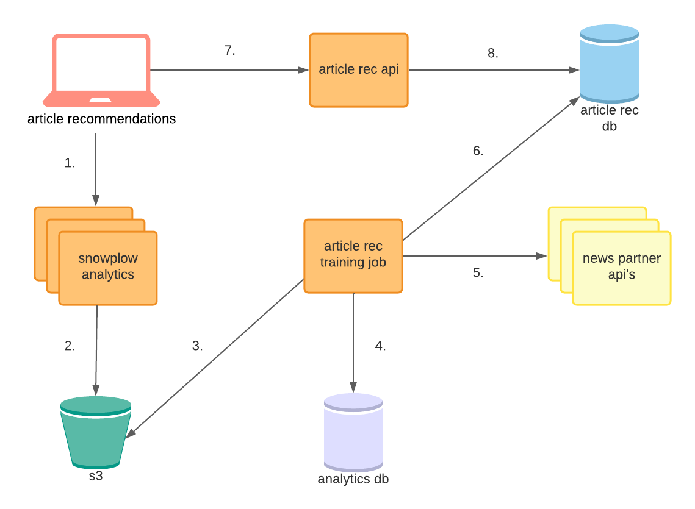

# article-rec-training-job

Job that runs every two hours to create a new batch of article recommendations, using the latest Snowplow data available.

## Directory Layout

```
.
├── cdk        # infrastructure as code for this service
├── db         # object-relational mappings to interact with the database
├── job        # key steps of the job pipeline (data fetch, preprocessing, training, etc...)
├── lib        # helpers to interact with lnl's aws resources
├── sites      # site-specific logic for each newsroom partner
└── tests      # unit tests
```

## Environment

Environment parameters are defined in `env.json`.

You can add a new secret parameter [using AWS SSM](https://www.notion.so/Working-with-SSM-Parameters-82df52fd71b24762b541cc8439f40e4e).


## Development Setup

1. Set up a [virtual environment](https://docs.python.org/3/library/venv.html) (or let your IDE do it for you).
2. Run `pip install -r requirements.txt`
3. Run `pip install pre-commit`
4. Run `pre-commit install`
5. To test it out, run `pre-commit run --all-files`


## Local Usage

1. Build container from the Dockerfile

```
kar build
```

2. Run the job

```
kar run
```

3. Or, run bash in the container

```
kar run bash
```

## Running Tests

1. Build container from the Dockerfile

```
kar build
```

2. Run unit tests

```
kar test
```

## Running Backfills

1. Build container from the Dockerfile

```
kar build
```

2. Run the backfill task for the data warehouse

```
kar backfill --start-date 2021-12-01 --days 10
```

5. Or, run the backfill task for the article table

```
kar article-backfill --site texas-tribune --start-date 2021-12-01 --days 10
```

## Deploying

For dev deployment, run:

```
kar deploy
```

Each pull request to main will trigger a new prod deployment when merged.

## Monitoring

### Logs

Each log group contains separate log streams for each client

- [Dev](https://console.aws.amazon.com/cloudwatch/home?region=us-east-1#logsV2:log-groups/log-group/DevArticleRecTrainingJobLogGroup)
- [Prod](https://console.aws.amazon.com/cloudwatch/home?region=us-east-1#logsV2:log-groups/log-group/ArticleRecTrainingJobLogGroup)

### System Dashboards

#### Philadelphia Inquirer

- [Dev](https://console.aws.amazon.com/cloudwatch/home?region=us-east-1#dashboards:name=dev-article-rec-training-job-pi;start=PT72H)
- [Prod](https://us-east-1.console.aws.amazon.com/cloudwatch/home?region=us-east-1#dashboards:name=article-rec-training-job-pi;start=PT72H)

#### Texas Tribune

- [Dev](https://console.aws.amazon.com/cloudwatch/home?region=us-east-1#dashboards:name=dev-article-rec-training-job-tt;start=PT72H)
- [Prod](https://us-east-1.console.aws.amazon.com/cloudwatch/home?region=us-east-1#dashboards:name=article-rec-training-job-tt;start=PT72H)

#### Washington City Paper

- [Dev](https://console.aws.amazon.com/cloudwatch/home?region=us-east-1#dashboards:name=dev-article-rec-training-job-wcp;start=PT72H)
- [Prod](https://console.aws.amazon.com/cloudwatch/home?region=us-east-1#dashboards:name=article-rec-training-job-wcp;start=PT72H)


## Hyperparamter tuning

Hyperparamter tuning is supported to find the model parameters that optimize the mean reciprocal rank of the model over a holdout test set.

To run a tuning job, modify the PARAMS object in the site you plan to run a job on. An exmaple is shown below:

```
PARAMS = {
    "hl": 15.0,
    "embedding_dim": 500,
    "epochs": 2,
     "tune": True,
     "tune_params": ["embedding_dim"],
     "tune_range": [[100,600,100]]
}
```

The tuner will grid search over all hyperparameter added to the `tune_params` key-value store. It will then search over the range in the corresponding index in the `tune_range` key-value store. The last value of the range is used as a step.

The tuner will output the best parameters to the logs and finally train the model on the best parameters it has found.


## Other Resources

### Misc Documentation

- [Monitoring Guide](https://www.notion.so/article-rec-backend-monitoring-30915f77759c4350b1b8588582c9ea04)
- [Redshift Migration Guide](https://www.notion.so/Redshift-Guide-21526b210bc3425cb80c2146f3b9e7e0)

### Related Repositories

- [`infrastructure`](https://github.com/LocalAtBrown/article-rec-api): The database and ECS clusters are created here.
- [`article-rec-db`](https://github.com/LocalAtBrown/article-rec-db): The relevant database migrations are defined and applied here.
- [`article-rec-api`](https://github.com/LocalAtBrown/article-rec-api): Calls to the API created by this repository return article recommendations and model versions saved by the training pipeline. The API is used to surface recommendations on the front-end.
- [`snowplow-analytics`](https://github.com/LocalAtBrown/snowplow-analytics): The analytics pipeline used to collect user clickstream data into s3 is defined in this repository.
- [`article-recommendations`](https://github.com/LocalAtBrown/article-recommendations): The recommendations are displayed on WordPress [NewsPack](https://newspack.pub/) sites using the PHP widget defined in this repository.

### Architecture Diagram


